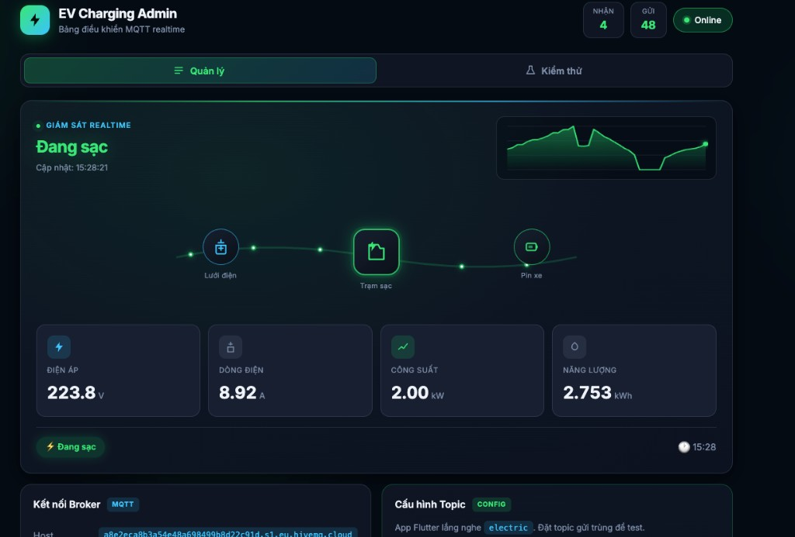
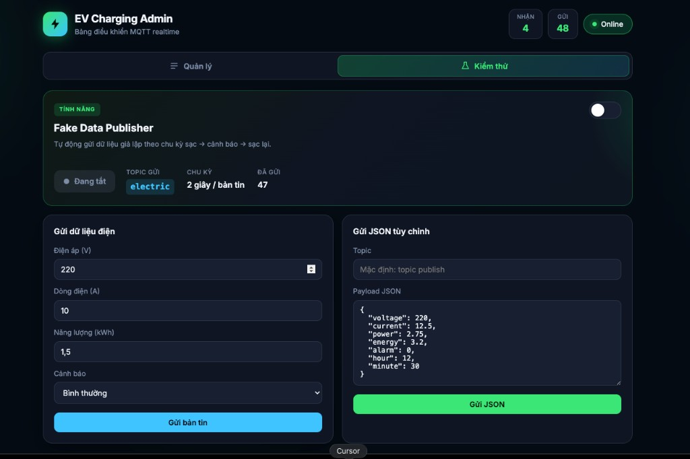
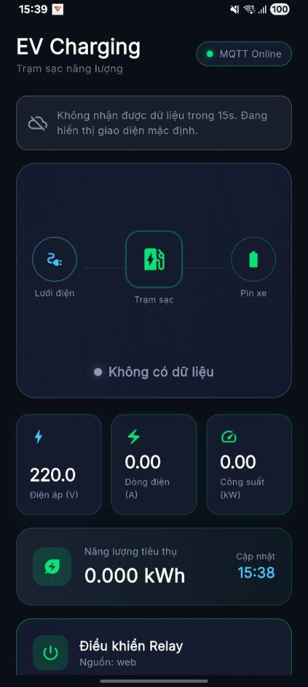

# EV Charging Station

Ứng dụng giám sát trạm sạc xe điện qua **MQTT**, điều khiển relay đồng bộ qua **Firebase Realtime Database**. Gồm:

| Thành phần | Mô tả |
|------------|--------|
| **App Flutter** | Giám sát điện áp, dòng, công suất + điều khiển relay |
| **Web Admin** | Dashboard MQTT, fake data kiểm thử, điều khiển relay |

Hướng dẫn chi tiết: [docs/HUONG_DAN_SU_DUNG.md](docs/HUONG_DAN_SU_DUNG.md)

---

## Giao diện

### Web Admin — Tab Quản lý

Dashboard giám sát realtime qua MQTT. Header hiển thị số bản tin **Nhận/Gửi** và trạng thái **Online**.



| Khu vực | Mô tả |
|---------|--------|
| **Giám sát realtime** | Trạng thái trạm (Đang sạc / Chờ dữ liệu), biểu đồ công suất, sơ đồ luồng Lưới điện → Trạm sạc → Pin xe |
| **Thẻ số liệu** | Điện áp (V), dòng điện (A), công suất (kW), năng lượng (kWh) |
| **Kết nối Broker** | Cấu hình host HiveMQ Cloud, nút Kết nối/Ngắt |
| **Cấu hình Topic** | Subscribe topic `electric` (app Flutter cũng lắng nghe topic này) |
| **Điều khiển Relay** | Bật/Tắt relay, đồng bộ Firebase + gửi MQTT topic `relay` |

### Web Admin — Tab Kiểm thử

Dùng để giả lập thiết bị gửi dữ liệu khi chưa có ESP32/hardware.



| Khu vực | Mô tả |
|---------|--------|
| **Fake Data Publisher** | Toggle bật/tắt — tự gửi JSON lên topic `electric` mỗi 2 giây, mô phỏng chu kỳ sạc → cảnh báo → sạc lại |
| **Gửi dữ liệu điện** | Form nhập điện áp, dòng, năng lượng, cảnh báo → bấm **Gửi bản tin** |
| **Gửi JSON tùy chỉnh** | Nhập topic và payload JSON thủ công → bấm **Gửi JSON** |

### App Flutter — Màn hình chính

Ứng dụng mobile giám sát trạm sạc, nhận dữ liệu từ topic `electric`.



| Khu vực | Mô tả |
|---------|--------|
| **Header** | Tiêu đề EV Charging, badge **MQTT Online/Offline** |
| **Cảnh báo timeout** | Hiện khi 15 giây không nhận dữ liệu — chuyển giao diện mặc định |
| **Sơ đồ luồng** | Lưới điện → Trạm sạc → Pin xe (animation theo trạng thái sạc) |
| **Thẻ số liệu** | Điện áp, dòng điện, công suất |
| **Năng lượng tiêu thụ** | Tổng kWh + thời gian cập nhật |
| **Điều khiển Relay** | Nút Bật/Tắt, hiển thị nguồn cập nhật (`app` / `web`) |

---

## Yêu cầu

- Flutter SDK (FVM 3.35.3 — xem `.fvmrc`)
- Node.js (chạy web admin)
- Firebase project **datn-cuan** với Realtime Database đã bật
- Kết nối internet (MQTT HiveMQ Cloud)

---

## Cài đặt nhanh

```bash
# App Flutter
cd ev_charging_station
flutter pub get

# Web Admin
cd web_admin
npm install   # tùy chọn — npm start dùng npx serve
```

### Firebase

1. Bật **Realtime Database** trên [Firebase Console](https://console.firebase.google.com)
2. Deploy rules từ `database.rules.json`
3. Kiểm tra `databaseUrl` khớp trong:
   - `lib/config/app_config.dart`
   - `web_admin/js/firebase-config.js`
4. Chạy `flutterfire configure --project=datn-cuan` nếu chưa cấu hình app

---

## Chạy App Flutter

```bash
flutter run
```

App tự kết nối MQTT khi mở. Màn hình chính gồm:

- **Trạng thái kết nối** — Online/Offline MQTT
- **Animation trạm sạc** — hiển thị theo dữ liệu realtime
- **Thẻ số liệu** — điện áp (V), dòng (A), công suất (kW), năng lượng (kWh)
- **Biểu đồ công suất** — lịch sử theo thời gian
- **Thẻ Điều khiển Relay** — nút **Bật** / **Tắt**, đồng bộ với web qua Firebase

> Nếu **15 giây** không nhận dữ liệu MQTT, app chuyển sang giao diện mặc định (chờ dữ liệu).

---

## Chạy Web Admin

```bash
cd web_admin
npm start
```

Mở trình duyệt: **http://localhost:3000**

### Tab Quản lý

1. Bấm **Kết nối MQTT** (góc trên phải chuyển sang Online)
2. Xem dashboard realtime: trạng thái trạm, biểu đồ công suất, số liệu
3. **Điều khiển Relay** — Bật/Tắt (Firebase + gửi MQTT topic `relay`)
4. Hộp thư bản tin và nhật ký hoạt động

### Tab Kiểm thử

Dùng tab này để **giả lập thiết bị** khi chưa có ESP32/hardware:

1. **Kết nối MQTT** (tab Quản lý) trước
2. Chuyển sang tab **Kiểm thử**
3. Bật **Fake Data Publisher** — tự gửi JSON lên topic `electric` mỗi 2 giây
4. Hoặc gửi thủ công / JSON tùy chỉnh

Payload mẫu topic `electric`:

```json
{"voltage":220,"current":10,"power":2.2,"energy":1.5,"alarm":0,"hour":14,"minute":30}
```

---

## Quy trình kiểm thử (App + Web)

### Test giám sát dữ liệu

```
Web Admin                    App Flutter
─────────                    ───────────
1. Kết nối MQTT
2. Tab Kiểm thử
   → Bật Fake Data    →    3. flutter run
                           4. Thấy số liệu + biểu đồ cập nhật
```

**Kiểm tra:** Cả web và app hiển thị cùng điện áp, dòng, công suất. Badge MQTT = Online.

### Test điều khiển Relay

```
App hoặc Web                 Firebase RTDB              Thiết bị
────────────                 ───────────────              ────────
Bấm Bật/Tắt          →     ev_charging/relay    →     subscribe topic relay
                     →     gửi MQTT {"state":1|0}
```

**Kiểm tra:**

1. Bật relay trên **Web** → App cập nhật trạng thái (nguồn: `web`)
2. Tắt relay trên **App** → Web cập nhật (nguồn: `app`)
3. Xem node `ev_charging/relay` trên Firebase Console
4. Xem log MQTT trên web (topic `relay`)

### Test timeout app

1. Bật Fake Data → app nhận dữ liệu
2. Tắt Fake Data, chờ **> 15 giây** không có bản tin mới
3. App hiển thị trạng thái chờ / dữ liệu mặc định

---

## MQTT Topics

| Topic | Hướng | Payload |
|-------|-------|---------|
| `electric` | Thiết bị/Web → App | JSON điện áp, dòng, công suất, năng lượng |
| `relay` | App/Web → Thiết bị | `{"state":1}` bật / `{"state":0}` tắt |

---

## Xử lý lỗi nhanh

| Triệu chứng | Cách xử lý |
|-------------|------------|
| App không nhận dữ liệu | Kiểm tra MQTT Online, bật Fake Data trên web |
| Relay không đồng bộ | Bật Realtime Database, kiểm tra `databaseUrl` và rules |
| Web relay không hoạt động | **Kết nối MQTT** trước khi bật/tắt relay |
| `flutterfire configure` lỗi | `firebase logout` → `firebase login --reauth` |

---

## Lệnh tham chiếu

```bash
flutter run
flutter build apk --debug
cd web_admin && npm start
flutterfire configure --project=datn-cuan
```
